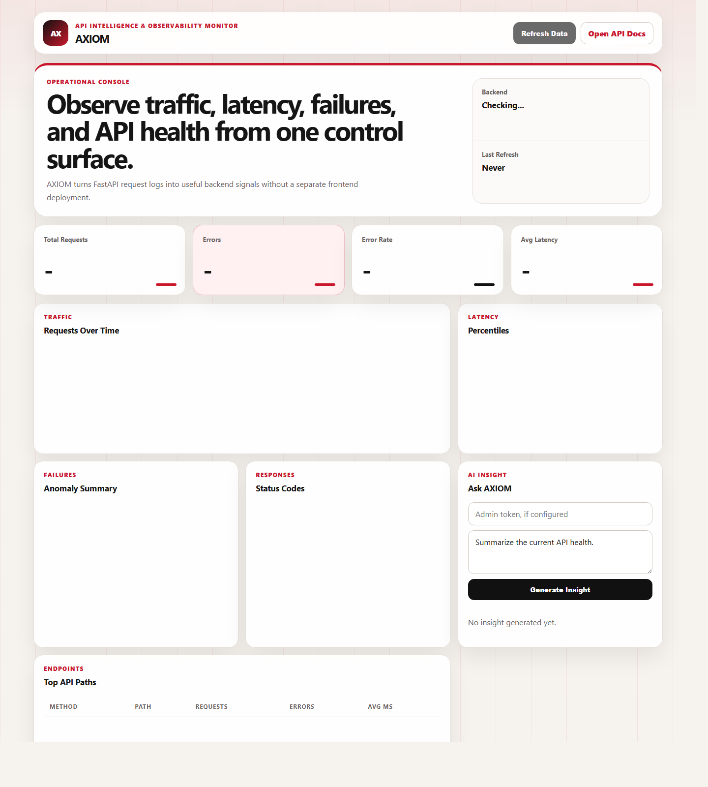

# AXIOM
### API Intelligence & Observability Monitor

> **"See everything. Understand anything."**

AXIOM is a lightweight, self-hosted API observability engine built with FastAPI. It logs your API traffic, detects anomalies, enforces rate limits, and uses AI to turn raw logs into plain-English insights — think a simplified Datadog or New Relic, built from scratch.

---

## Dashboard



The dashboard is served directly by the FastAPI app at `/dashboard`. It gives an operational view of the API by combining request logs, analytics, anomaly summaries, status-code breakdowns, recent activity, clickable request inspection, and AI-generated insights.

---

## What AXIOM Does

AXIOM observes API traffic from inside the FastAPI request lifecycle. Every request passes through middleware that records key details, persists them, and makes them available to analytics, anomaly detection, dashboard views, and AI summaries.

Core workflow:

1. A request enters the FastAPI app.
2. API key/rate-limit middleware checks access and usage limits.
3. Request logging middleware records method, path, status code, latency, client IP, user agent, and timestamp.
4. Analytics endpoints aggregate request logs into dashboard-ready metrics.
5. Anomaly detection identifies slow responses, error spikes, and traffic bursts.
6. Gemini-backed insights summarize API health in plain English when configured.

---

## Features

- **Request Logger** — captures method, path, status code, response time, client IP, user agent, and timestamp.
- **Analytics Engine** — exposes summary metrics, endpoint usage, slowest endpoints, error-heavy endpoints, latency percentiles, traffic buckets, and status-code breakdowns.
- **Anomaly Detection** — detects slow responses, error-rate spikes, and traffic bursts using configurable thresholds.
- **API Key System** — creates, tracks, and revokes API keys while counting per-key usage.
- **Rate Limiting** — throttles requests by client IP or API key with rate-limit response headers.
- **AI Insight Layer** — uses Gemini when configured and falls back to deterministic local summaries for offline development.
- **Admin Protection** — protects mutating management actions with an optional `X-Admin-Token` header.
- **Built-in Dashboard** — serves a responsive static dashboard with KPI cards, analytics panels, request inspection, and AI insight generation from the backend without requiring a separate frontend deployment.
- **Docker + CI Ready** — includes Docker, Docker Compose, deployment notes, and a GitHub Actions pytest workflow.

---

## Architecture

```text
Client / Dashboard
        |
        v
FastAPI application
        |
        |-- API access middleware
        |   |-- API key validation
        |   |-- IP/API-key rate limiting
        |
        |-- Request logging middleware
        |   |-- Records request metadata
        |   |-- Persists traffic logs
        |
        |-- API routers
        |   |-- /logs
        |   |-- /analytics
        |   |-- /anomalies
        |   |-- /api-keys
        |   |-- /insights
        |   |-- /dashboard
        |
        v
SQLAlchemy models
        |
        v
SQLite locally / PostgreSQL in production
```

---

## Tech Stack

| Layer | Technology |
|---|---|
| Framework | FastAPI |
| Database | PostgreSQL (SQLite for dev) |
| ORM | SQLAlchemy |
| AI Layer | Gemini API |
| Rate Limiting | slowapi + Redis |
| Deployment | Docker + Railway |
| Testing | pytest |

---

## Project Structure

```text
app/
  api/            FastAPI routers for logs, analytics, anomalies, API keys, insights, and dashboard
  core/           settings, logging, exception handlers, and admin-token security
  db/             SQLAlchemy engine/session setup and local table initialization
  middleware/     request logging, API key access, and rate limiting middleware
  models/         SQLAlchemy models for logs, anomalies, API keys, and AI insights
  schemas/        Pydantic response/request schemas
  services/       anomaly detection, API key helpers, and Gemini insight generation
  static/         dashboard HTML, CSS, and JavaScript
tests/            pytest coverage for implemented behavior
migrations/       Alembic migration environment
docs/             project screenshots and documentation assets
```

---

## Local Development

Create a virtual environment and install dependencies:

```bash
py -m venv .venv
.venv\Scripts\python -m pip install -e ".[dev]"
```

Run the API locally:

```bash
.venv\Scripts\python -m uvicorn app.main:app --reload
```

Optional local configuration can be copied from `.env.example` into `.env`:

```text
APP_NAME=AXIOM
APP_VERSION=0.1.0
ENVIRONMENT=local
DEBUG=false
LOG_LEVEL=INFO
DATABASE_URL=sqlite:///./axiom.db
SLOW_RESPONSE_THRESHOLD_MS=1000
ERROR_RATE_THRESHOLD_PERCENT=50
TRAFFIC_BURST_THRESHOLD_COUNT=100
ENABLE_RATE_LIMITING=true
IP_RATE_LIMIT_PER_MINUTE=1000
API_KEY_RATE_LIMIT_PER_MINUTE=1000
REDIS_URL=
CORS_ORIGINS=*
GEMINI_API_KEY=
ADMIN_TOKEN=change-this-local-admin-token
GEMINI_MODEL=gemini-1.5-flash
```

`DATABASE_URL` defaults to a local SQLite database for development. Set it to a PostgreSQL connection string when running against a production database.

Open the API in your browser:

```text
http://127.0.0.1:8000/
http://127.0.0.1:8000/dashboard
```

Swagger/OpenAPI docs are available at:

```text
http://127.0.0.1:8000/docs
```

Run tests:

```bash
.venv\Scripts\python -m pytest
```

Create a database migration after changing SQLAlchemy models:

```bash
.venv\Scripts\python -m alembic revision --autogenerate -m "describe schema change"
.venv\Scripts\python -m alembic upgrade head
```

Health check endpoint:

---

## API Overview

Health check:

```text
GET /health
```

Request logs:

```text
GET /logs?limit=20&offset=0
GET /logs?method=GET&status_code=404&path=/api
GET /logs?start_time=2026-01-01T00:00:00&end_time=2026-01-02T00:00:00
GET /logs/{log_id}
GET /logs/recent?limit=20
```

AXIOM logs API requests automatically, excluding `/health` to avoid polluting traffic data with uptime checks.

Analytics:

```text
GET /analytics/summary
GET /analytics/summary?start_time=2026-01-01T00:00:00&end_time=2026-01-02T00:00:00
GET /analytics/endpoints?limit=20
GET /analytics/slowest-endpoints?limit=20
GET /analytics/error-endpoints?limit=20
GET /analytics/traffic?interval=hour
GET /analytics/latency-percentiles
GET /analytics/status-codes
GET /analytics/status-code-families
```

Anomaly detection:

```text
GET /anomalies?limit=20&offset=0
GET /anomalies/summary
GET /anomalies/preview
POST /anomalies/detect
```

API keys:

```text
GET /api-keys?limit=20&offset=0
POST /api-keys
POST /api-keys/{api_key_id}/revoke
GET /api-keys/{api_key_id}/analytics
```

AI insights:

```text
GET /insights?limit=20&offset=0
POST /insights
```

Management endpoints can be protected with `ADMIN_TOKEN`. When it is set, include this header for mutating admin actions:

```text
X-Admin-Token: your-admin-token
```

Protected actions include creating/revoking API keys, persisting anomaly detection results, and generating AI insights.

Dashboard:

```text
GET /dashboard
GET /dashboard/summary
```

Use the `X-API-Key` header to track API key usage. Requests without an API key are still accepted and rate limited by client IP.

AI insights use Gemini when `GEMINI_API_KEY` is configured. Without a key, AXIOM stores a deterministic local summary so development and tests remain offline-friendly.

Never commit real API keys. `.env.example` should contain placeholders only; put local secrets in `.env`.

---

## Testing

Run the full test suite:

```bash
.venv\Scripts\python -m pytest
```

Current coverage validates health checks, request logging, log filters, analytics, anomalies, API keys, admin-token protection, insights, and dashboard serving.

---

## Docker

Build and run with Docker:

```bash
docker build -t axiom .
docker run -p 8000:8000 axiom
```

Or use Docker Compose:

```bash
docker compose up --build
```

---

## Resume Highlights

- Built a self-hosted API observability platform with FastAPI, SQLAlchemy, middleware-based request logging, analytics, anomaly detection, API key tracking, rate limiting, and AI-generated operational summaries.
- Designed dashboard-ready APIs and a live dashboard for request volume, latency, error rates, endpoint usage, status codes, anomalies, and recent logs.
- Added Docker support, CI test workflow, admin-token protection, and pytest coverage across core observability workflows.
